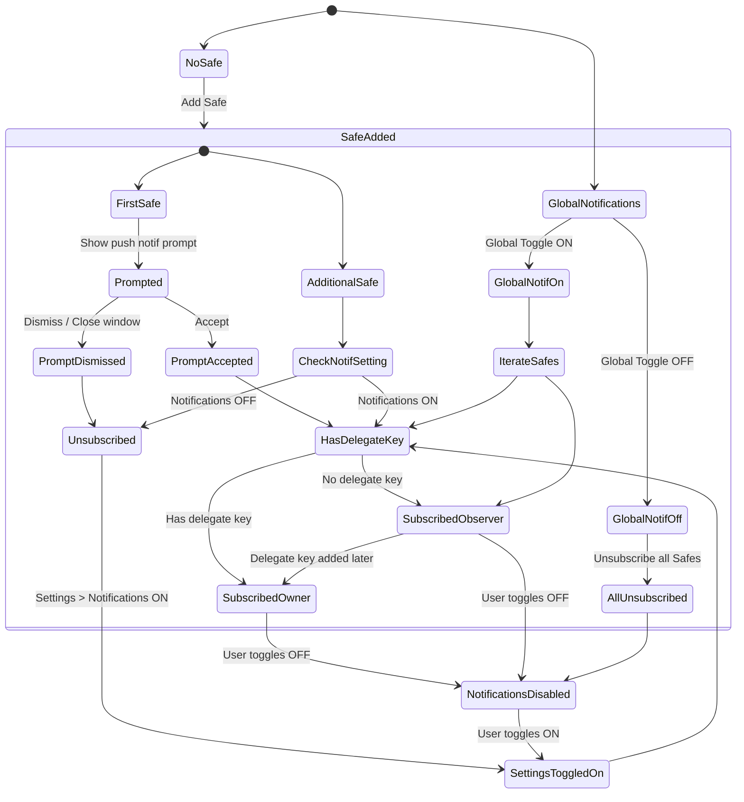

# Push Notifications

This document explains how push notifications are implemented in the Safe{Wallet} mobile app. It covers the subscription flow, how notifications are displayed, and differences between iOS and Android.

---

## 1. Overview

The app uses **Firebase Cloud Messaging (FCM)** together with **Notifee** to handle push notifications. When a user enables notifications, the app registers the device with FCM and then subscribes each Safe to receive updates from the Safe backend. Notifications are displayed via Notifee, which allows customization for both platforms.

---

## 2. Subscription Flow

1. The user is prompted to enable notifications when adding the first Safe or via Settings.
2. If accepted, the app requests device permissions and fetches an FCM token (`FCMService.initNotification`).
3. The token, Safe address and chain IDs are sent to the backend using `registerSafe`.
4. Each Safe subscription status is stored in the Redux store.
5. Users can toggle notifications per Safe or globally in Settings. Toggling triggers `subscribeSafe` or `unsubscribeSafe`.

The state diagram below summarises the logic for prompting and subscribing:

---

## 3. Displaying Notifications

Notifications are shown using the `NotificationService` class which wraps Notifee. It listens for FCM messages both in the foreground and background and displays them with the proper channel and priority. The message payload is parsed in `notificationParser.ts` to generate a user friendly title and body. Badge counts are incremented or decremented when notifications are delivered or opened.

When the app starts, `NotificationService.initializeNotificationHandlers()` sets up all listeners so that notifications are handled even when the app is not running.

---

## 4. Platform Differences

### iOS

- Uses a **Notification Service Extension** (`NotificationService.swift`) to intercept the push payload when the app is in the background. The extension reads data stored via `startNotificationExtensionSync` and rewrites the notification title/body.
- Opening the notification settings uses `Linking.openURL('app-settings:')`.
- iOS badges are updated with `notifee` and can show a banner or list presentation when the app is active.

### Android

- Notifications are handled directly by Notifee using FCM. There is no additional extension layer.
- Device settings are opened with `Linking.openSettings()`.
- Android uses channels defined in `notificationChannels` with importance `HIGH` and visibility `PUBLIC` to display alerts.

Both platforms share the same subscription logic and redux state but differ in how the underlying OS displays and processes the notification payload.

---

## 5. Troubleshooting

- If notifications stop arriving, ensure that device permissions are granted and that the Safe is subscribed on the backend.
- Logs from `FCMService` and `NotificationService` can help diagnose token or delivery issues.

---

Push notifications ensure users stay informed about Safe activity regardless of whether the app is open. The flow above keeps subscription status in sync and provides a consistent experience across iOS and Android.
